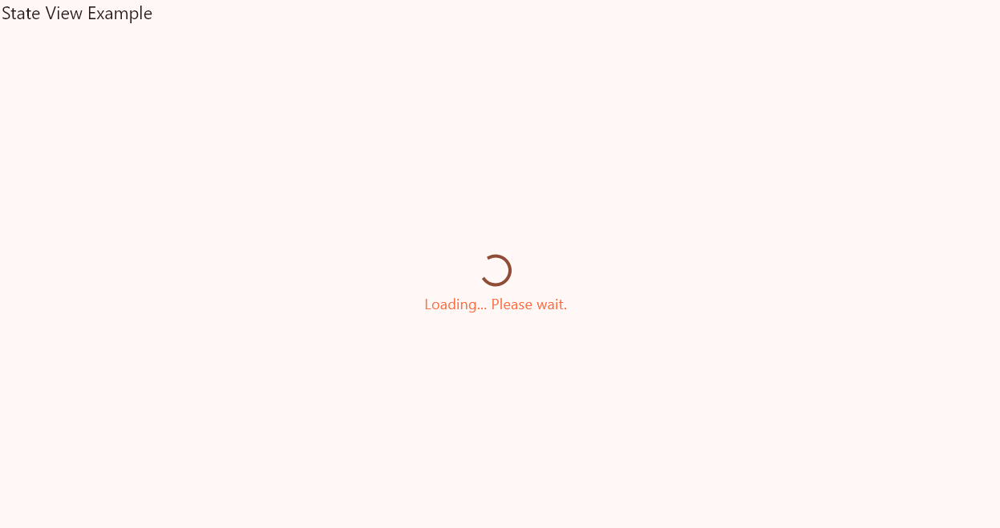
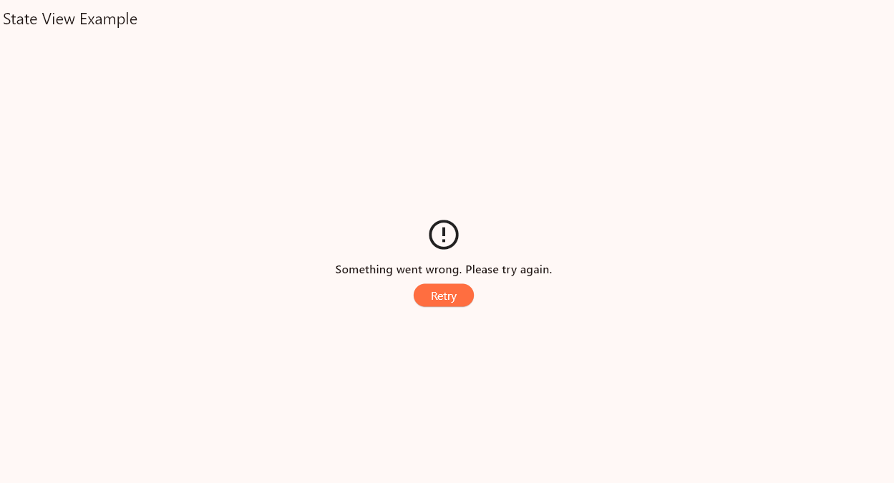
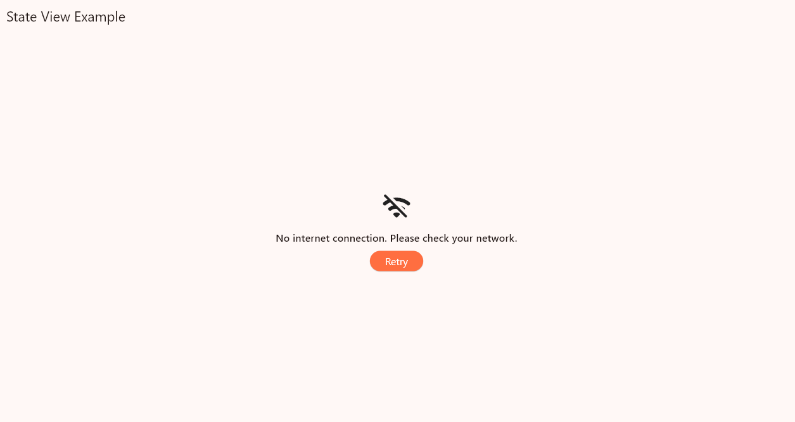
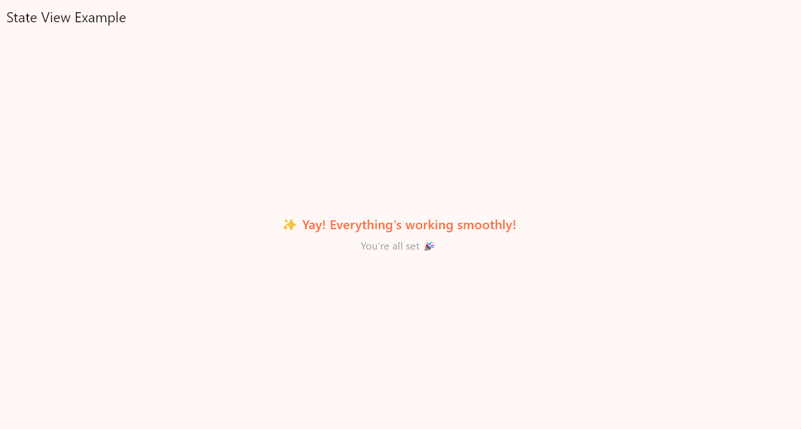

# 🧩 State View

**A simple yet powerful Flutter widget for handling loading, content, error, and network error UI states — with just one line of code.**

---

## ✨ Preview


  



---

## 🚀 Features

✅ Show different UI states effortlessly  
✅ Built-in retry support  
✅ Easily customizable widgets  
✅ Fully theme-aware  
✅ Flutter + Dart package ready for production

---

## 🛠 Usage

```dart
StateView(
  state: ViewState.loading, // or content, error, networkError
  content: Text("🎉 Content Loaded!"),
  onRetry: _fetchData, // optional retry callback
);
```

🎯 ViewState Options

```dart
ViewState.loading

ViewState.content

ViewState.error

ViewState.networkError
```

🎨 Customization
You can override the default UI for each state:

```dart
StateView(
  state: ViewState.error,
  content: YourContentWidget(),
  errorWidget: Column(
    children: [
      Text("Something went wrong"),
      ElevatedButton(onPressed: _retry, child: Text("Retry")),
    ],
  ),
)
```

📦 Installation
Add this to your pubspec.yaml:

```yaml
dependencies:
state_view: ^1.0.0
```

Then run:

```bash
flutter pub get
```
